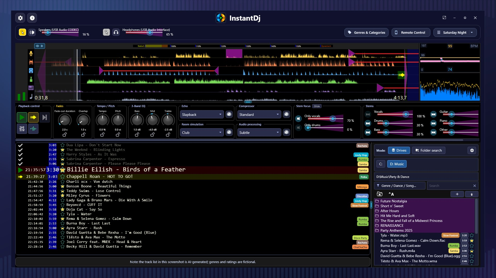
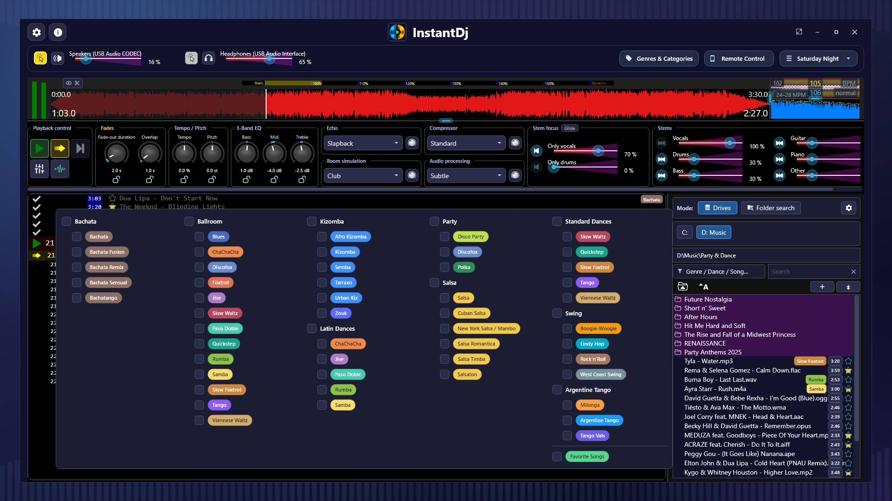
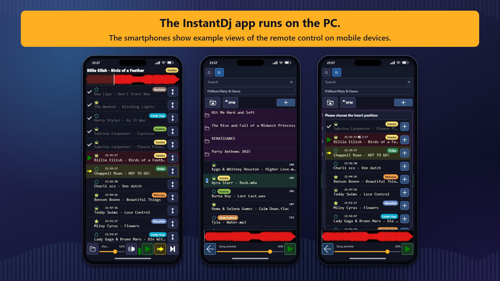
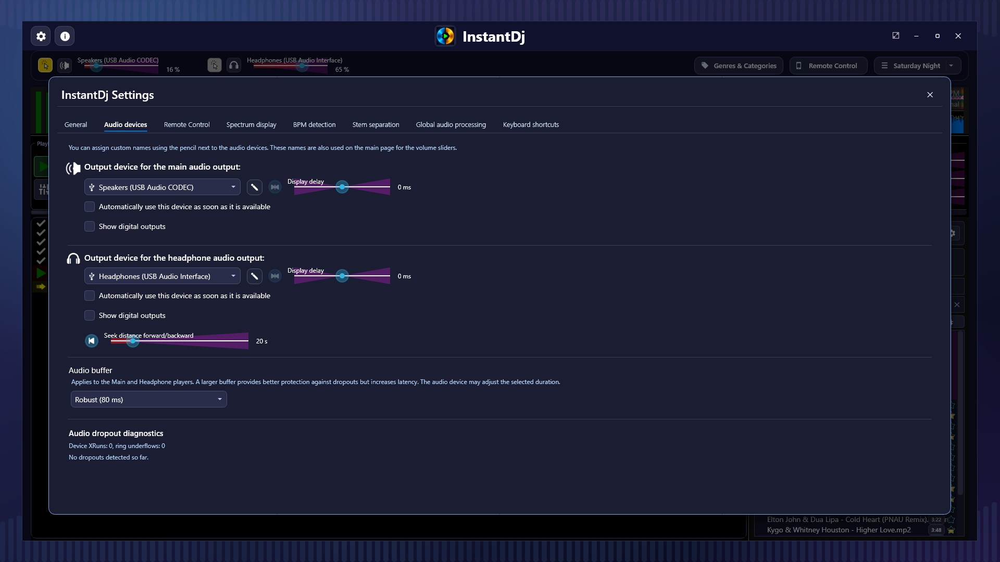
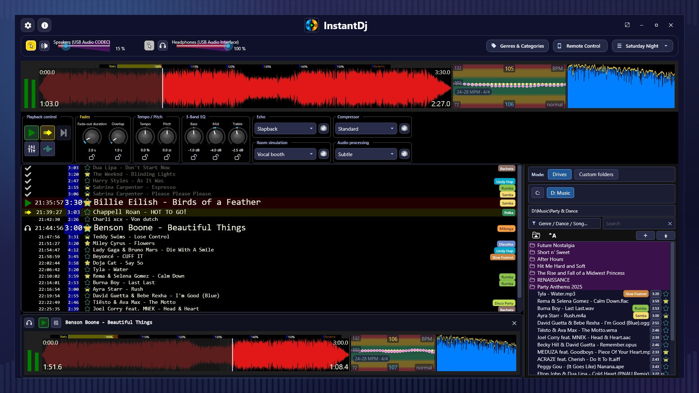

# Instant DJ

Instant DJ is a DJ application for parties, events and mobile DJs. Organize your music by genre and dance style, mix with audio effects and control everything remotely — so you can focus on the party.



<p>
  
  
</p>
<p>
  
  
</p>
<p>
  
  
</p>

## Get Instant DJ

| Platform | Availability |
|----------|--------------|
| **Windows** | [Microsoft Store](https://apps.microsoft.com/detail/9phr4qq9jgc7) |
| **macOS** | App Store — coming soon |
| **Linux** | **Free of charge** — download below from [Releases](../../releases/latest) |

## Linux downloads

Get the latest version from the **[Releases page](../../releases/latest)**. The following packages are provided:

| File | For |
|------|-----|
| `InstantDj-x.y.z-x86_64.AppImage` | Any Linux distribution — no installation required |
| `instantdj_x.y.z_amd64.deb` | Debian, Ubuntu, Linux Mint |
| `instantdj-x.y.z.x86_64.rpm` | Fedora, openSUSE |
| `InstantDj-x.y.z-linux-x64.tar.gz` | Generic archive for all other distributions |

### AppImage (recommended)

```bash
chmod +x InstantDj-*.AppImage
./InstantDj-*.AppImage
```

### Debian / Ubuntu / Mint

```bash
sudo apt install ./instantdj_*_amd64.deb
```

### Fedora / openSUSE

```bash
sudo dnf install ./instantdj-*.x86_64.rpm
```

### Generic archive

```bash
tar -xzf InstantDj-*-linux-x64.tar.gz
cd InstantDj
./InstantDj
```

### System requirements

- 64-bit Linux (x86_64)
- X11 or Wayland desktop session
- PulseAudio or PipeWire audio server

## Support

Questions, bug reports and feature requests: please use the **[issue tracker](../../issues)** of this repository.

## License

Instant DJ is proprietary software. The Linux binaries provided here are free of charge and may be redistributed unmodified. All other rights reserved.
